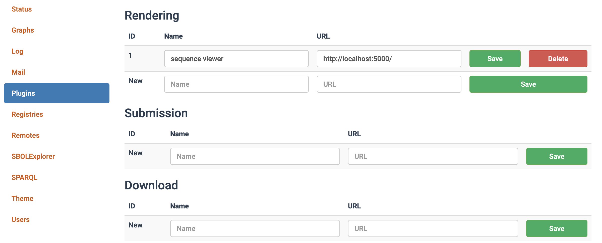

# Project Description

Sequence View Plugin is a visualization plugin engine for SynBioHub to enhance the functional annotations of DNA sequence which are coordinated with the SBOL Visual standard. 

# Installation

Follow the instructions on the [GitHub README](https://github.com/SynBioHub/synbiohub#manual-installation) to install SynBioHub locally on your system and start the SynBioHub process. In the Admin module, configure the plugin as follows:

1. Clone the Sequence View Plugin repository `git clone git@github.com:alicelh/sequence-view-plugin.git`
2. Change to the  Sequence View Plugin directory `cd sequence-view-plugin`
3. Install all the dependencies `npm install`
4. Start the plugin server `npm start`
5. When you change the plugin code and want to see the updated effect in the interface, use `npm run dev`

# Publish

Releases are published automatically using GitHub Actions. There is an action which fires on release publication. It publishes an image to Docker Hub as synbiohub/plugin-visual-seqviz, which will be used in public SynBioHub.
