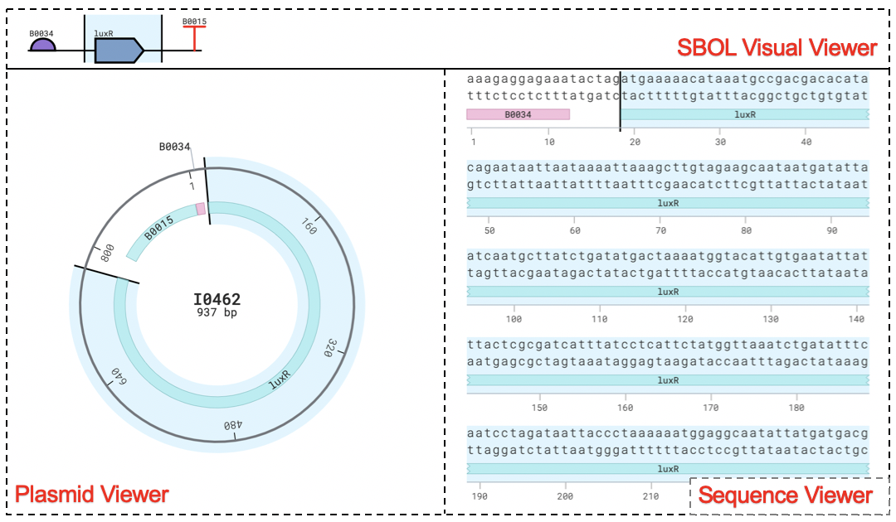
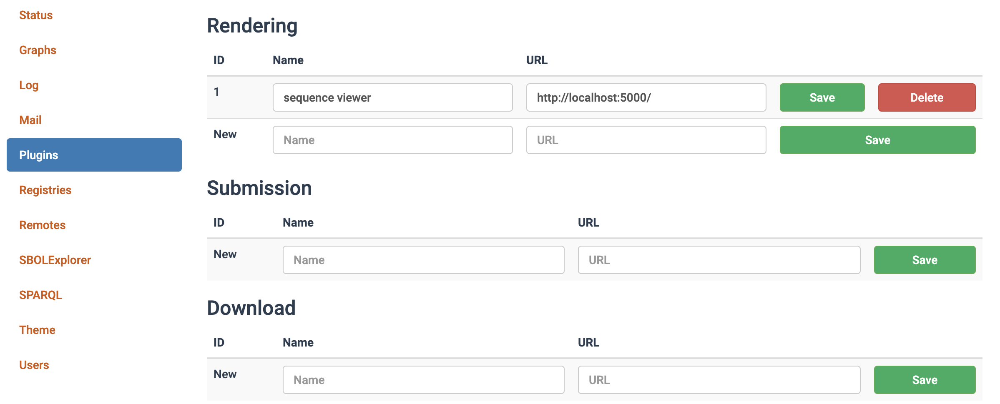

# Project Description

Sequence View Plugin is a visualization plugin engine for SynBioHub to enhance the functional annotations of DNA sequence which are coordinated with the SBOL Visual standard. 

# Interface

# Installation

Follow the instructions on the [GitHub README](https://github.com/SynBioHub/synbiohub#manual-installation) to install SynBioHub locally on your system and start the SynBioHub process. In the Admin module, configure the plugin as follows:

1. Clone the Sequence View Plugin repository `git clone https://github.com/alicelh/sequence-view-plugin.git`
2. Change to the  Sequence View Plugin directory `cd sequence-view-plugin`
3. Install all the dependencies `npm install`
4. Start the plugin server `npm run local`

# Publish

Releases are published automatically using GitHub Actions. There is an action which fires on release publication. It publishes an image to Docker Hub as synbiohub/plugin-visual-seqviz, which will be used in public SynBioHub. It should be noticed that docker use server.js to start the server. The only difference between server.js and localserver.js is on line 67 where the src uses http or https. Thus, what other code updates in localserver.js should also be reflected in server.js. 
